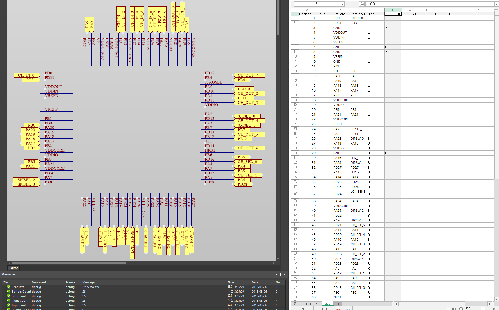

# QuickPortFromCsv

This Delphi Script for EDA workers.

Just Like this pictures.

Feature
--------------------
Create Pin and Port 
* Ignore specific row by writing 'X' in col F.
* Seperate Port Label and Net Label.
* Auto size decision for Port and Wire (10pt New Romans).
* Quad Side for each pin by writing 'L,B,R,T' in col E.
* Getting start location from col:0, x-row:F, y-row:G
* Something Else ...

How To Use
---------------------
1. Make Script Project. (PrjScr)
2. Copy this script.
3. Change csv file path in 'Procedure main' - PlaceViaCsv('C:\demo.csv');
4. Make and open a empty schematic document.
5. Run Script and 
* Finish.

Why I made this
---------------------
Because I need to change some pin mux with same MCU or little different MCU from past project. Sometimes EDA coworker claimed for frequent mux changing while developing. 

### contacts : pmnxis@gmail.com
### License : MIT License

